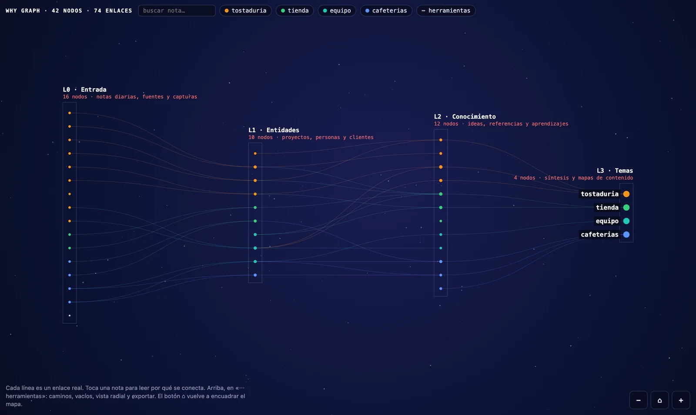
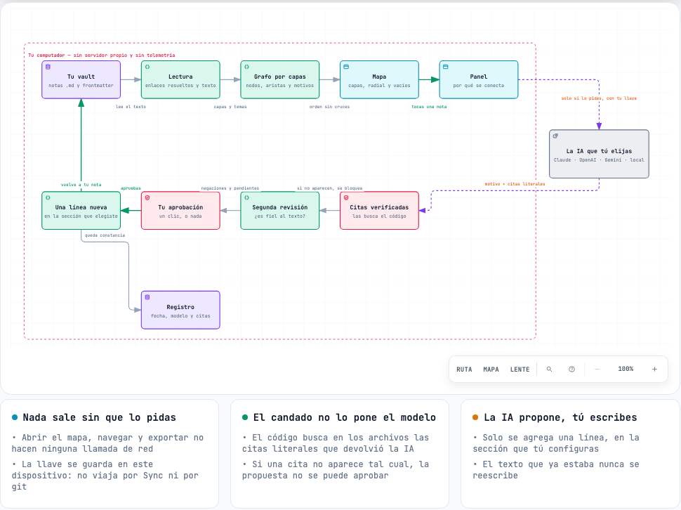
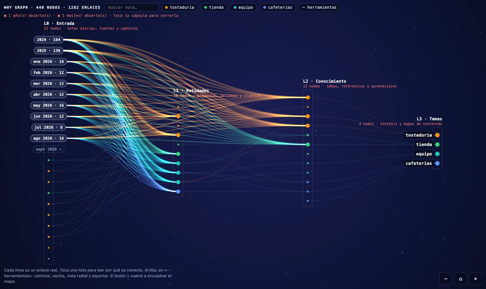
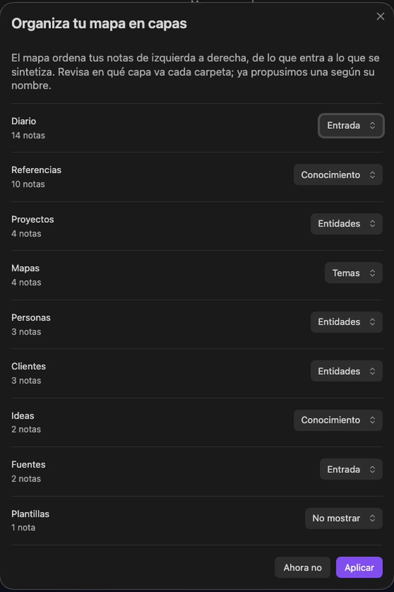
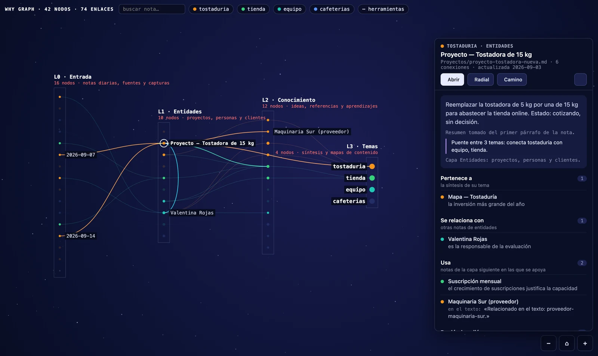
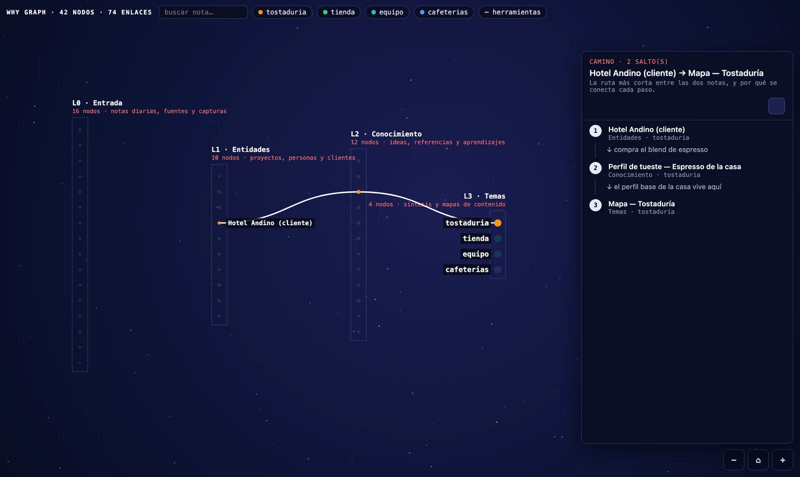
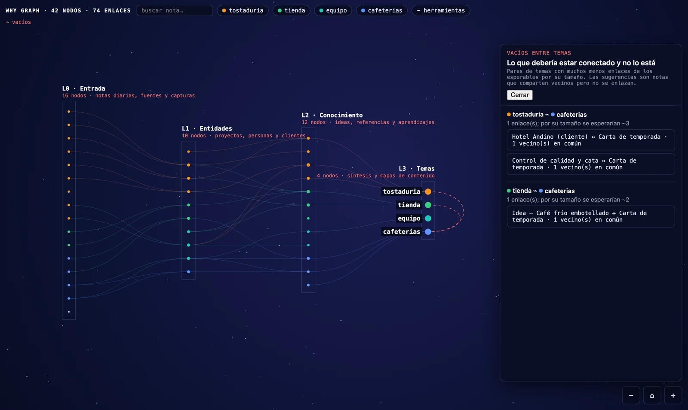
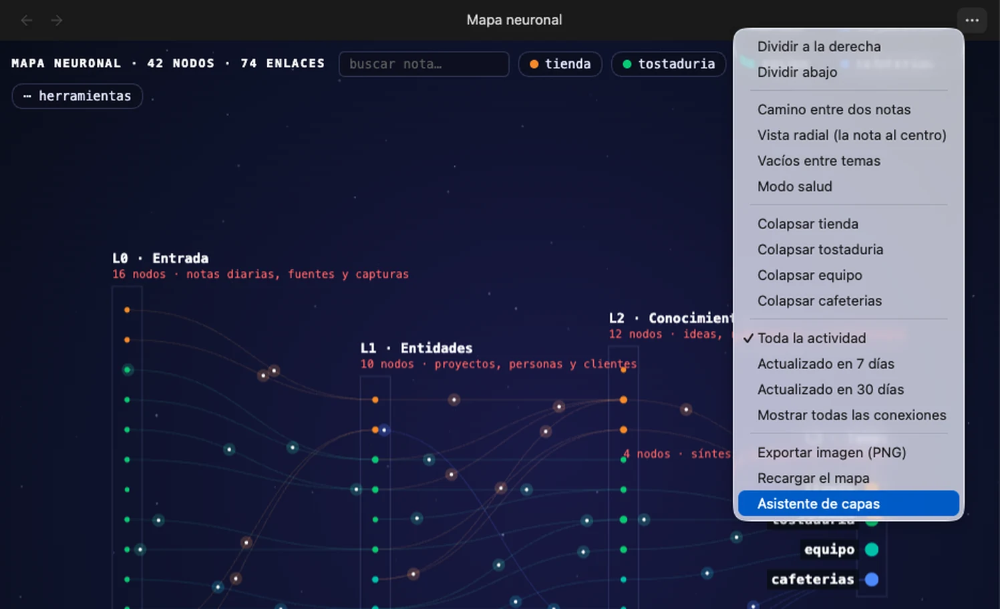
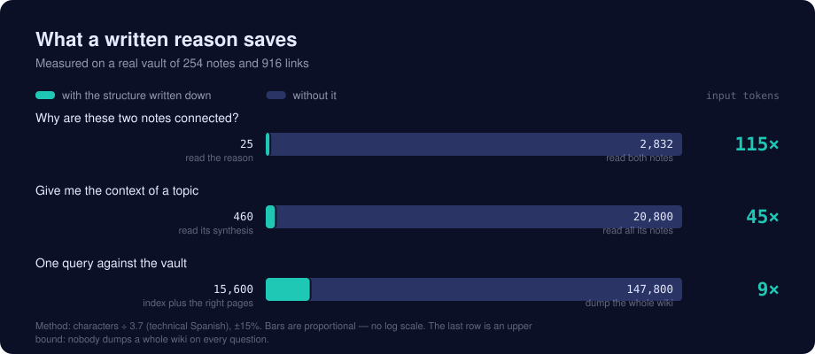

# Why Graph

*English · [Leer en español](README.es.md)*

**See your vault as a layered neural network — and read *why* each note connects to the next.**

Obsidian's graph shows you *that* two notes are linked. It never tells you *why*. In a
vault of a few hundred notes that is a hairball: pretty, and useless for thinking.

Why Graph lays your notes out in layers, left to right, the way information actually
moves through a knowledge base: what comes in → what it is about → what you learned →
what it all adds up to. Click any note and you get the sentence in which the link was
written. Not a guess: the real line from your own note.



## What it expects from your vault

The map draws the structure you already have. **If your notes live in one flat folder with
no topics and no reasons written down, you will see one column and little else** — not a
bug, just an honest picture of a vault with no layers yet.

It pays off when your vault has, or is moving towards:

- **Folders that mean something.** Not `notes/`, but something like sources, projects and
  people, ideas, topics. The first-run wizard reads your folders and proposes a layer for
  each; three to five layers is the sweet spot.
- **A property that groups notes** (`tema` by default, any name you like). That is what
  gives each note its colour and makes topics collapsible. Optional: without it the map
  still works, in one colour.
- **The habit of saying why you link.** When a note carries
  `- [[other-note]] — the reason`, the panel shows your words. When it does not, the panel
  falls back to the actual sentence where the link appears — and the AI can propose the
  missing reason for you to approve.

This plugin grew inside a vault built on the **LLM wiki** pattern — Andrej Karpathy's
[original design](https://gist.github.com/karpathy/442a6bf555914893e9891c11519de94f):
immutable raw sources on one side, a curated wiki the LLM maintains on the other, and a
written contract between them. It does not require that pattern, and it names no folder of
its own — but that is the shape it was designed against. Any vault with a deliberate
structure (PARA, Zettelkasten with MOCs, a digital garden with topic hubs) gets the same
benefit.

If you run an LLM wiki, the map does something specific for you: the raw layer becomes the
first column, the curated wiki the middle ones, and the syntheses the last — so you can see
at a glance whether your sources are actually being distilled, or just piling up.

If your vault is flat today, the map is still useful as a diagnosis: it shows you exactly
how much of your thinking is sitting in one undifferentiated pile.

## How it works



Everything above the dashed AI box happens inside your computer, with no network call at
all. The AI is reached only when you ask for a suggestion, with your key; whatever it
proposes has to survive a code check of its quotes and your approval before a single line
is written back to your note. The interactive version of this diagram is in
[`docs/diagramas/mapa-neuronal.html`](docs/diagramas/mapa-neuronal.html) — download it and
open it in a browser.

## What it does

- **Layers, not a hairball.** You decide which folders belong to which layer (a wizard
  proposes one on first run). Notes inside a layer are ordered to minimise crossing
  lines, so the paths you see are the paths that exist.
- **Every link carries its reason.** Click a link and the panel shows either the reason
  you curated (`- [[note]] — why`) or the real sentence from the note where the link
  appears. Nothing is invented.
- **Paths.** Pick two notes and it draws the shortest chain between them, step by step,
  with the reason for each hop. This is how you find out that two projects you thought
  were related are actually four hops apart.
- **Gaps.** It compares the links that exist against the links you would expect between
  two topics (shared neighbours, density) and names the pairs that should be connected
  and are not. In my own vault it found two topics with 0 links where ~26 were expected.
- **It survives a long vault.** The input layer grows by one note a day; after a year that
  is 365 dots in a row. Dated notes fold into an accordion — **years, then months, then
  days** — so three years of daily notes read as three labels. Click a capsule to open it,
  click it again to close: the capsule of an open group stays in place, above its notes.

  

- **Clippings group by where they came from.** The input layer answers two questions: *what
  did I write* (time) and *where did I get this* (origin). Notes with a source property —
  Obsidian Web Clipper writes `source` — fold into capsules per domain: `github.com · 12`,
  `x.com · 8`. A plain-text source works too, grouped by that text.

- **Radial view.** Centre on one note and see its world in rings: direct neighbours,
  then theirs. The animation travels outward ring by ring.

  
- **Reasons with *your* AI (optional).** If you connect an AI provider, it proposes a
  reason for links that have none — always with a literal quote from both notes, always
  verified by code, and never written to your notes until you approve it.
- **English and Spanish.** The interface follows Obsidian's own language setting.
- **Works on the phone.** Same map, same proportions, touch gestures. No separate
  mobile build.
- **Export.** PNG for slides, an Obsidian Canvas you can keep editing, or a standalone
  HTML page.

## Install

### From the community directory

Community plugins → Browse → search "Why Graph" → Install → Enable.
*(Pending review at the time of writing — use one of the two ways below meanwhile.)*

### With BRAT — installs and keeps updating itself

The usual way to install a plugin straight from GitHub:

1. Install **Obsidian42 - BRAT** from the community plugins.
2. Command palette → **BRAT: Add a beta plugin for testing**.
3. Paste `DBB-FC/why-graph`.

BRAT installs it, enables it, and updates it on every release.

### By hand

Download `main.js`, `manifest.json` and `styles.css` from the
[latest release](https://github.com/DBB-FC/why-graph/releases/latest) into
`<vault>/.obsidian/plugins/mapa-neuronal/`, then enable it in Settings → Community
plugins. Nothing else is needed: those three files are the whole plugin.

Open it with the command **Open neural map** (`Cmd/Ctrl+P`) or the brain icon in the
left ribbon.

## First run, in one minute

1. Open the map. A wizard lists your folders with a proposed layer for each one
   (Input / Entities / Knowledge / Topics / Don't show). Change what looks wrong and
   press Apply.

   

2. Click any note. The side panel names its layer, its topic, a two-line summary and
   every link with its reason.

   

3. `···` → **Path between two notes**, pick two, and read the chain.

   

4. `···` → **Gaps between topics**, to see what should be connected and is not.

   

That's it. No configuration needed beyond the wizard, and no AI key required for any of
the above.

Everything else lives in the tools menu — the `⋯ tools` chip on the map, or the tab's own
`···` menu:



## Settings worth knowing

| Setting | What it changes |
|---|---|
| **Layers** | One line per layer: `Name \| description`. Three to five works best. |
| **Folders** | Which folder goes to which layer. The wizard writes this for you. |
| **Topic property** | The frontmatter property that groups and colours notes (default `tema`). Empty = no topics. |
| **Notes visible per layer** | In large vaults each layer shows its most connected notes; the rest appear when you search or open them. Default 150. |
| **Connections section** | The heading at the end of each note where approved reasons are written. |
| **External links property** | Frontmatter properties holding web links (`Title \| https://…`, `https://…`, `user/repo`). Empty = the section never appears. Only `http`/`https` are opened. |
| **Last-modified property** | If set, approving a reason also writes today's date in that property. Empty by default: the plugin never touches your frontmatter. |
| **Animation** | Light pulses travelling along the links. Only while the map is visible, and off if your system asks for reduced motion. |

## Bring your own AI (optional)

The map works with no AI at all. If you connect one, it can propose reasons for links
that have none and short summaries for notes that have no description.

Supported: **Anthropic (Claude)**, **OpenAI**, **Google (Gemini)**, and any
**OpenAI-compatible local server** (Ollama, LM Studio, LocalAI) — the local option
needs no key and no internet.

Reasons and summaries are written **in the language of your notes**, not in the language of
the interface.


### Does it work with my Claude or ChatGPT subscription?

**No, and no plugin can.** Subscriptions (Claude Pro/Max, ChatGPT Plus) pay for the vendor's
own apps; there is no public API you can authenticate with a subscription. The API is a
separate product, billed per token with prepaid credit.

Three ways to deal with that:

- **Local AI — free.** Ollama or LM Studio on your own machine: no key, no cost, and your
  notes never leave the computer. This is the answer if you do not want to pay per use.
- **Your own key.** A few cents per suggestion — roughly **$0.04** with Claude Opus 5 (two
  notes plus the review pass). New API accounts get free credit to try it.
- **No AI at all.** The whole map works without any of it. The AI only proposes reasons for
  links that do not have one; everything else — layers, paths, gaps, radial, export — never
  makes a network call.

Plugins that appear to run on "one subscription" are doing one of two things: using a local
model (free, like the option above), or paying the API with the developer's own key and
charging you a subscription for it — which means **your notes pass through their server**.
This plugin has no server, so that trade is not on the table.

### How to set it up

Four fields: pick the provider, paste your key, choose the model, and press
**Test the connection** — one tiny call that tells you whether it answers, without sending
any note. The key is stored on this device only.

Three rules the plugin enforces, whatever provider you pick:

1. **Quotes are verified by code.** The model must return a literal quote from each of
   the two notes. The plugin looks for those quotes in the files. If a quote is not
   there, the proposal is marked unverifiable and cannot be approved. This is what
   stops confident invention.
2. **A second pass reviews the first.** A separate call checks the reason against the
   quotes for negations, states and pending items ("we decided not to use X" must not
   become "we use X"). You can turn it off; it costs twice as much and catches the
   subtle errors.
3. **Nothing is written without you.** Approving is a click. Only then does the reason
   go into your note, under the heading you configured, and only as a new line — the
   plugin never rewrites existing text.

Every approval is logged (date, model, quotes, resulting text) in a note under the audit
folder, so you can audit or undo later.

### Measured accuracy

On a real vault of 254 notes and 916 links, over a reproducible sample of 44 links
reviewed blind against the source notes:

| | Correct | Wrong or invented | Unverifiable (blocked) |
|---|---|---|---|
| First attempt: small model, only the link's sentence | 48% | 16% | — |
| Current method: full notes + verified quotes + second pass | **97.7%** | **0%** | 2.3% |

That measurement was made with **Claude Opus 5**. With other models the locks still
apply — a proposal without verifiable quotes still cannot be approved — but the hit rate
is untested; treat it as unknown until you measure it on your own vault.

### Cost and privacy

- Your notes go to the provider **you** choose, with **your** key, at **your** cost. The
  plugin has no server. The author never sees your notes, your keys or your queries.
- Keys are stored per device in Obsidian's local storage — never in `data.json`, so they
  never travel through git, Obsidian Sync or a backup.
- Nothing is sent until you ask for a suggestion. Opening the map, browsing, paths and
  gaps make zero network calls.
- Rough cost per suggestion with Claude Opus 5: two notes of context plus the review
  pass. A vault with a hundred reason-less links costs single-digit dollars to work
  through — and you never have to do it in one go.
- The local provider (Ollama) sends nothing anywhere: no key, no internet, no cost.

## What a written reason saves



The plugin does not save tokens by itself — the structure does, and the plugin is what makes
the missing pieces impossible to ignore. Its own AI feature *spends* tokens: about 3,900 of
input per suggestion, roughly **$0.04** with Claude Opus 5.

What pays off is the other direction. A reason is written once and read many times: by you,
and by any agent that works against your vault. The three rows above were measured on the
author's vault — 254 notes, 916 links, ~147,800 tokens of wiki — by counting characters ÷ 3.7
and comparing what each question costs to answer with and without the written structure. Your
numbers will differ; the ratios are what travel.

The honest caveat is in the figure: nobody dumps a whole wiki on every question — an agent
greps. The defensible comparison is the first row, **reading the reason instead of opening
both notes**, and that one is 115×.

## Large vaults

Tested on a vault with 5,043 notes and 17,526 links. Each layer draws its most
connected notes (default 150) and reveals the rest on demand, so the map stays
interactive instead of drawing a grey rectangle. Radial view caps each ring at 80.

## Does it change my notes?

Only when you press **Approve** on an AI suggestion, and only as an appended line in the
connections section of that one note. Existing text is never rewritten or reordered, and
your frontmatter is not touched unless you fill in the *Last-modified property* setting,
which is empty by default.

Everything else — layers, colours, paths, gaps, exports — is read-only. Exports are the
one other write: a PNG into the folder you choose.

There is no telemetry, no analytics and no server: the plugin makes no network request
except the AI call you ask for, to the provider you configured.

It does read the list of every note in your vault — a map cannot be drawn from a subset —
and the release assets carry [GitHub attestations](https://github.com/DBB-FC/why-graph/attestations),
so you can verify they were built from this source:

```bash
gh attestation verify main.js --repo DBB-FC/why-graph
```

## Looks

The map draws on a dark canvas in both light and dark Obsidian themes — like a night sky,
so the topic colours and the light pulses along the links stay readable. The panel, the
chips and the settings follow your theme.

## Build from source

Everything runs from `src/`; the release is one esbuild pass, unminified.

```bash
npm install
npm test        # builds src/main.js → main.js and checks the translations
npx eslint src/ # the official Obsidian plugin linter
./instalar-en-vault.sh /path/to/your/vault
```

`src/main.js` is the source. `main.js` in the repository root is the build output and is
not committed — releases carry it. The build is a single esbuild pass, no minification, so
the released file stays readable.

## Licence

[MIT](LICENSE). Free for anything — personal or commercial — and you may fork it, change
it and redistribute it, keeping the copyright notice.

The plugin itself charges nothing and has no paid tier. The Obsidian directory still
labels it **optional payments**, because it can connect to AI services that charge you
directly with your own key; the local provider (Ollama, LM Studio) costs nothing at all.

## Support

Bugs and ideas: GitHub issues. Include your Obsidian version, your platform, and the
number of notes and links the map header shows.

---

<a href="https://dontbuybuild.cl">
  <picture>
    <source media="(prefers-color-scheme: dark)" srcset="docs/imagenes/dbb-labs-oscuro.svg">
    
  </picture>
</a>

Built by **Felipe Córdova** · Powered by [DBB Labs](https://dontbuybuild.cl) — *Don't buy. Build.*

Free, MIT, no paid tier. If the map showed you something you had not seen, a coffee is welcome
— and if it did not, the plugin still works exactly the same.

<a href="https://www.buymeacoffee.com/DbbLabs"></a>
